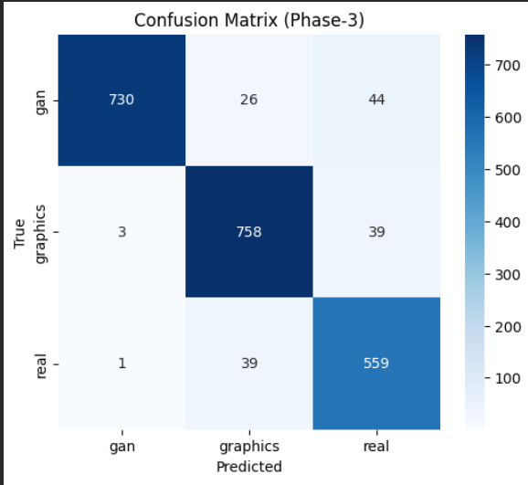
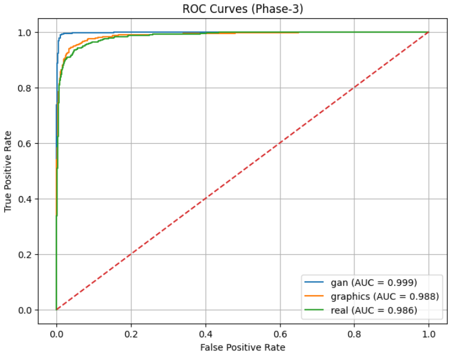
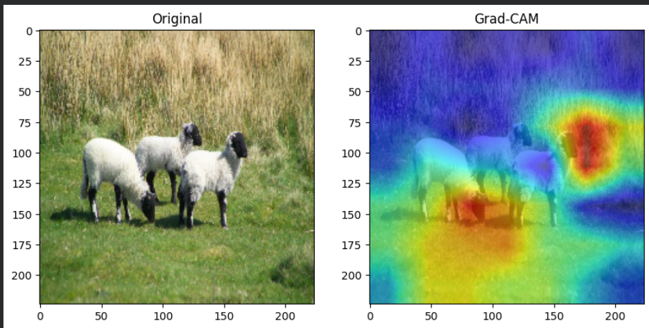

# GAN-CG-Real-Image-Classification

A deep learning project that classifies images into three categories using **ResNet50** with Transfer Learning:

- 🎭 GAN Generated Images
- 🎨 Computer Graphics (CG)
- 📷 Real Images

---

## 📌 Model

**Architecture:** ResNet50 (Transfer Learning)

**Framework:** TensorFlow / Keras

---

## 📊 Model Performance

| Class | Precision | Recall | F1-Score | Support |
|:------|----------:|-------:|---------:|--------:|
| GAN | 0.99 | 0.91 | 0.95 | 800 |
| Computer Graphics (CG) | 0.92 | 0.95 | 0.93 | 800 |
| Real | 0.87 | 0.93 | 0.90 | 599 |

**Overall Accuracy:** **93.00%**

---

# 📈 Results

## Confusion Matrix

<p align="center">
  
</p>

---

## ROC Curve

<p align="center">
  
</p>

---

## Grad-CAM Visualization

<p align="center">
  
</p>

---

## 🚀 Technologies Used

- Python
- TensorFlow
- Keras
- ResNet50
- OpenCV
- NumPy
- Matplotlib
- Scikit-learn

---

## 📂 Dataset

The dataset contains three classes:

- GAN Generated Images
- Computer Graphics (CG)
- Real Images

> **Note:** The dataset is not included in this repository due to its large size.

---

## ▶️ How to Run

```bash
git clone https://github.com/<your-github-username>/GAN-CG-Real-Image-Classification.git
```

Install the required libraries:

```bash
pip install -r requirements.txt
```

Open the notebook and run all cells.

---

## 👩‍💻 Author

**Nikita Singh Chauhan**

B.Tech Computer Science Engineering

Jaypee University of Engineering and Technology, Guna
